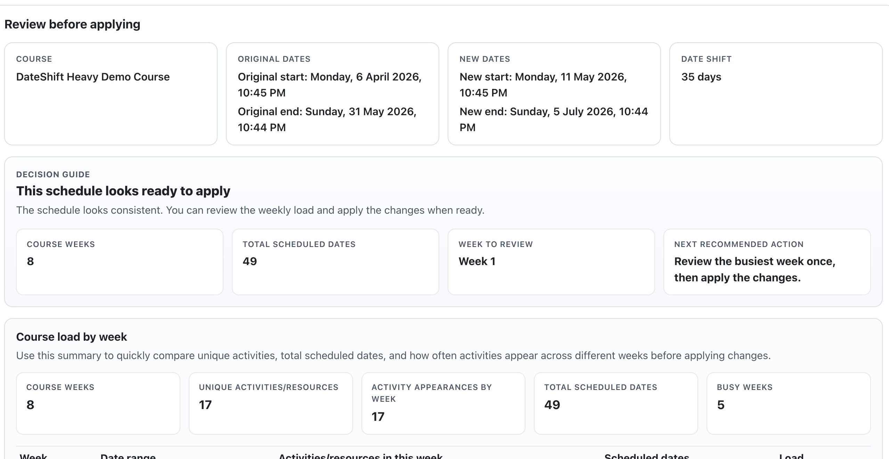
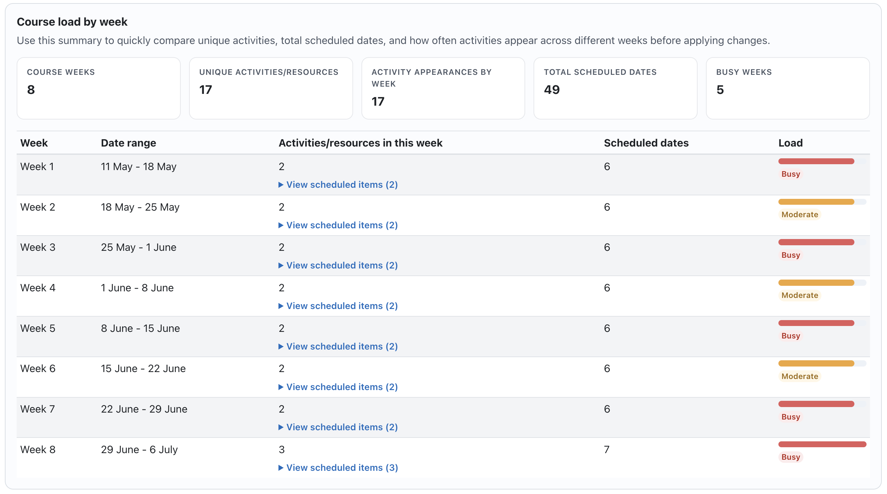
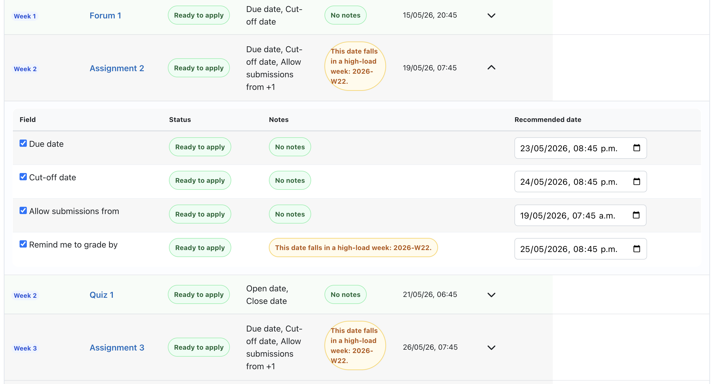
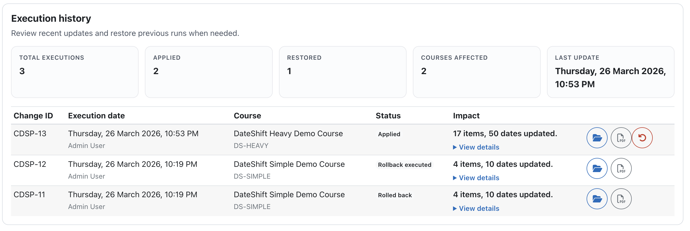
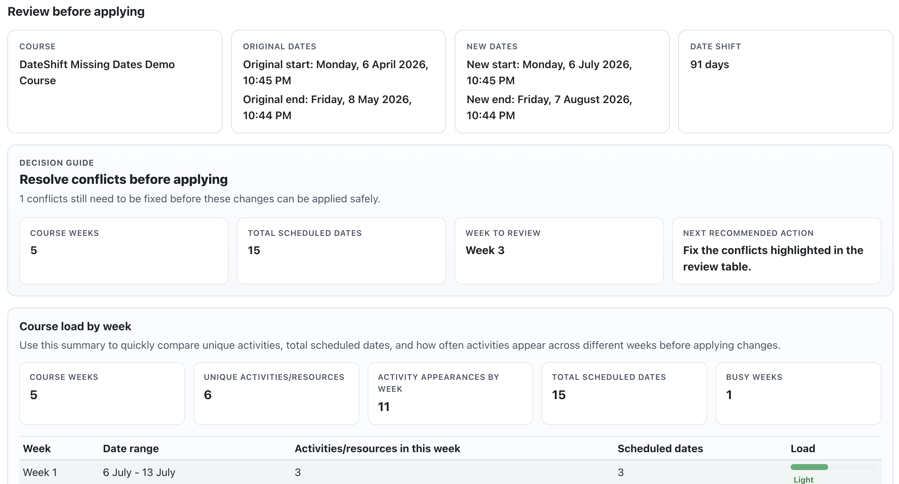
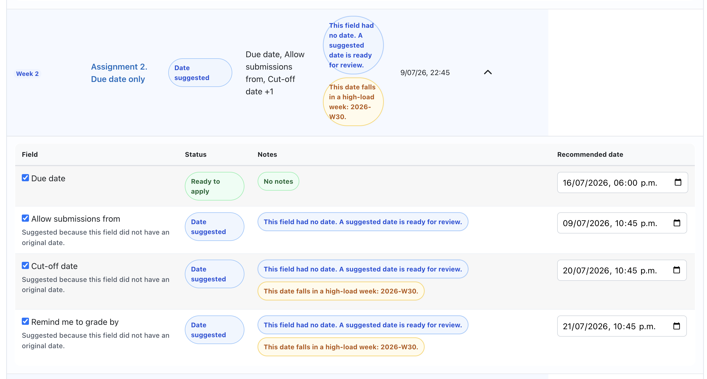

# Course Date Shift Pro

Course Date Shift Pro is a Moodle local plugin that helps administrators review, adjust, apply, restore, and export course date changes with a guided preview workflow.

## What It Solves

Rescheduling a Moodle course usually means checking many dates across activities, restrictions, overrides, completion settings, and course-level rules. This plugin turns that into a guided review flow before anything is saved.

With Course Date Shift Pro, users can:

- shift a course timeline from a new start date
- review changes before applying them
- work in a simpler teacher-friendly mode or a deeper advanced mode
- understand weekly workload distribution before saving
- edit recommended dates directly in the review table
- keep linked activity dates aligned
- restore previous executions from history
- export a branded PDF report with before/after detail

## Key Capabilities

- Guided preview before applying real changes
- `Simple review` and `Advanced review` modes
- Weekly course load overview with drill-down detail
- Decision guide with readiness summary and next recommended action
- Expandable grouped review table by activity or resource
- Editable recommended dates inside the preview
- Suggested dates for missing scheduling fields
- Linked assignment-style date suggestions
- Execution history with restore support
- Branded PDF export from saved executions
- AJAX preview based on Moodle External Services and `core/ajax`

## Screenshots

### Guided review overview

### Weekly load by course week

### Simple review table

### History and restore

### Missing dates and linked suggestions

## Installation

Plugin component:

`local_coursedateshiftpro`

Expected Moodle installation folder:

`local/coursedateshiftpro`

The Moodle release ZIP should be uploaded as:

`local_coursedateshiftpro.zip`

The ZIP itself must contain this plugin root:

`coursedateshiftpro/`

## Basic Workflow

1. Go to `Site administration > Plugins > Local plugins > Course Date Shift Pro`.
2. Select a course.
3. Load the course.
4. Choose the new course start date.
5. Configure selective rescheduling.
6. Generate the preview.
7. Review the result in `Simple review` first.
8. Open `Advanced review` only when you need more technical detail.
9. Edit recommended dates if needed.
10. Apply the selected changes.
11. Use `History and restore` to inspect, reopen, restore, or export prior executions.

## Included Areas

- Course summary cards
- Decision guide
- Weekly load overview
- Readiness overview
- Review table with grouped activity/resource detail
- Timelines
- History dashboard
- Restore flow
- PDF execution report

## Documentation

- [User manual](MANUAL_EN.md)
- [Changelog](CHANGELOG.md)
- [Publication guide](docs/publication-guide.md)
- [Screenshot set](docs/screenshots/pro-1.9.2/README.md)

## Current Release

- Internal version: `2026032429`
- Release: `1.9.2-pro-pdf-branding-freeze`
